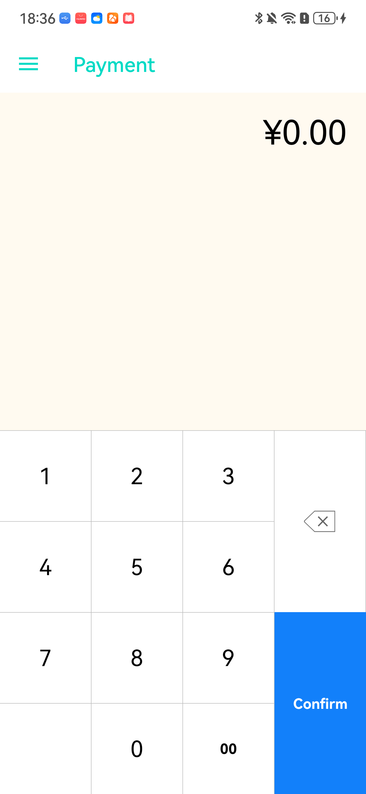
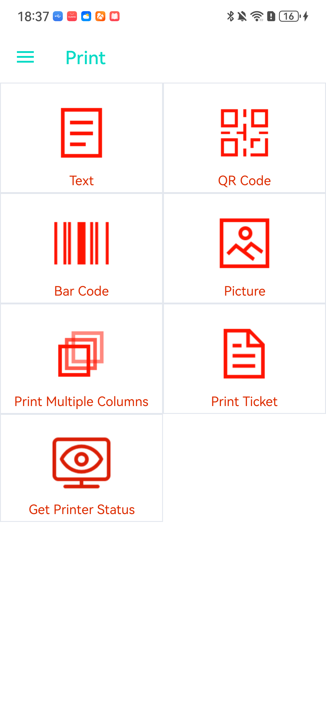
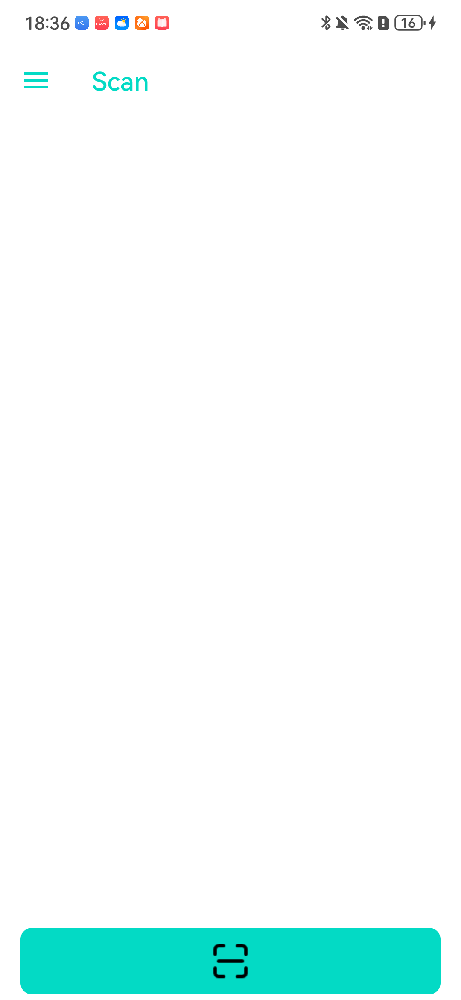

# 🚀 Set Up Integration


**Good to know:**  For development convenience, our terminal come in debug mode by default, so&#x20;

* ADB enabled: ADB command is helpful for developer to install app or debug app, which is not secure for payment terminal. So we will disable ADB on release version devices for security, app can be only installed by OTA with TMS.
* Debug watermark: avoid developer misuse development samples and production devices. Debug watermark will be removed on release production devices
* Keystore: the purpose of keystore file is to prevent unkown app installed on device and break device security. So you need use dspread keystore file to sign your app to be able install your app on debug device. For production device, we will use your own keystore signature extracting from your signed apk, so that only you have permission to install app on your device ([app.keystore](https://github.com/DspreadOrg/android/blob/master/pos_android_studio_demo/pos_android_studio_app/app.keystore):page\_facing\_up:)


### Smart POS SDK

<table><thead><tr><th width="102.4000244140625">Module</th><th width="244.39996337890625">Downlodd</th><th>Description</th><th data-hidden></th></tr></thead><tbody><tr><td>payment</td><td><a href="https://github.com/DspreadOrg/android/releases">dspread_pos_sdk.jar</a></td><td>handle card reading and pinpad functionalities</td><td></td></tr><tr><td>printer</td><td><a href="https://github.com/DspreadOrg/android/releases">dspread_print_sdk.aar</a><br></td><td>print receipts</td><td></td></tr><tr><td>scanner</td><td>                            -</td><td>refer to <a href="scanner-qr-bar-code.md">scanner intent</a> service</td><td></td></tr></tbody></table>

Add following code to project `build.gradle` file:

```
plugins {
  id("com.android.application")
}

android { ... }

dependencies {
  implementation 'com.dspread.print:dspread_print_sdk:1.3.9-beta'
  implementation 'com.dspread.library:dspread_pos_sdk:7.0.7'
}
```

### Sample

* [demo apk download](https://github.com/DspreadOrg/android/releases)
* [demo code](https://github.com/DspreadOrg/android)

Demo app UI preview

|  |  |  |
| -------------------------------------- | ------------------------------------ | -------------------------------------- |

